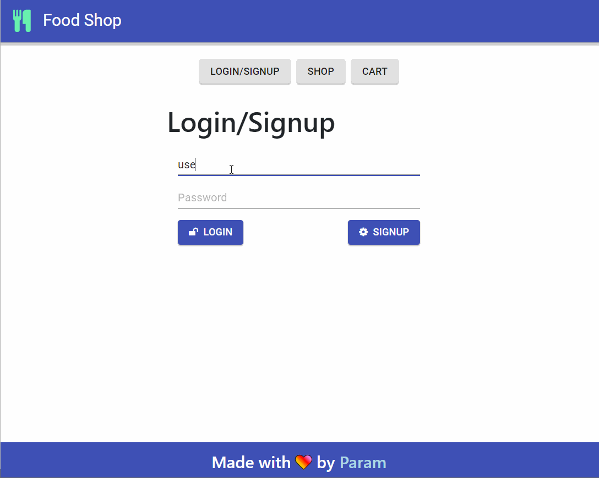

# Food Shop
A working e-commerce website build using Express and React, styled using Material-UI and Bootstrap.

The application is live here: http://paramsiddharth.github.io/web-cart



## Development (Back-end)
Navigate to `backend`.
``` bash
cd backend
```

Install the dependencies using either of the following commands:
- ``` bash
  npm ci
  ```
- ``` bash
  npm install
  ```

Start the Express server using Node. It starts on port 5000 by default. Another port may be specified via the `PORT` environment variable.
```bash
npm start # Port 5000 by default
```

The server will be live at http://localhost:5000.

## Development (Front-end)
Navigate to front-end.
```bash
cd frontend
```

Install the dependencies using either of the following commands:
- ``` bash
  npm ci
  ```
- ``` bash
  npm install
  ```

Specify the back-end API URL via the `REACT_APP_API_URL` environment variable. If you choose not to, it assumes the API to be running at `http://localhost:5000`. Please note that you must NOT include the trailing '/' after the URL when specifying it in the environment variable.

Start the React development server. You may define a custom port using the `PORT` environment variable. The default will be 3000.
```bash
npm start
```

The development server will be live at http://localhost:3000.

To deploy the application, build a production-optimized version and host it statically. Make sure you properly configure the routes while doing so.
```bash
npm build
```

The built application will be present inside the `build` directory.

# Made with ❤ by [Param](http://www.paramsid.com).
